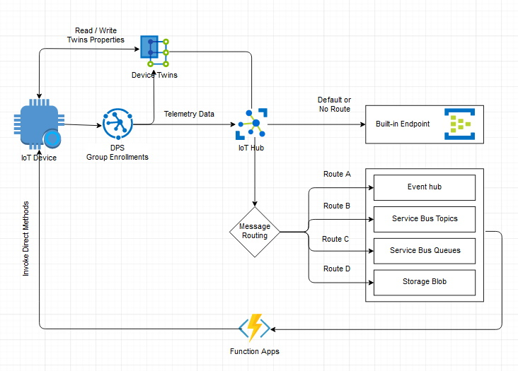

# iot-hub-dps-symetric-key
The idea is to use Azure DPS to provision iot-devices at scale using group enrollment and connect them to an iot-hub. These iot-devices then send telemetry data to the iot-hub. Some function apps should listen to those events and invoke Direct Methods on those iot-devices. I am using .net 6 and Autofac for DI.



## How to run locally
There are two projects. DeviceSimulator that sends telemetery data to an IotHub. FunctionApp to receive telemetry data from IotHub. Create azure IotHub and Azure DPS and ServiceBus resources. Connect your IotHub to the DPS. Create a group enrollment in the DPS with symetric key Attestation type. Add a queue "DeviceSimulator" in the Service Bus. Add a message routing in the IotHub with a query ``` route="DeviceSimulator" ``` to route telemetry data to a Service Bus Queue you just created.


Function App local.settings.json
```
{
  "IsEncrypted": false,
  "Values": {
    "FUNCTIONS_WORKER_RUNTIME": "dotnet",
    "IotHubEndPoint": "YOUR_IOT_HUB_ENDPOINT",
    "ServiceBusConnectionString": "YOUR_SERVICE_BUS_CONNECTION_STRING"
  }
}
```

DeviceSimulator Program.cs
```
private static string s_idScope = "DPS_ID_SCOPE";
private const string GlobalDeviceEndpoint = "DPS_GLOBAL_DEVICE_ENDPOINT";
private const string enrollmentGroupPrimaryKey = "GROUP_ENROLLMENT_PRIMARY_KEY";
private const string enrollmentGroupSecondaryKey = "GROUP_ENROLLMENT_SECONDARY_KEY";
private static string s_registrationID = "will-become-device-id-123";
```

Run the Function App then run the DeviceSimulator and debug away.
