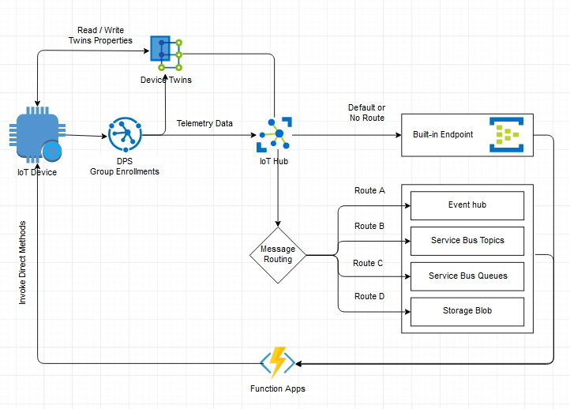

# iot-hub-dps-symetric-key
The idea is to use Azure DPS to provision iot-devices at scale using group enrollment and connect them to an iot-hub. These iot-devices then send telemetry data to the iot-hub. Some function apps should listen to those telemetry data received in the iot-hub and invoke Direct Methods on those iot-devices.

